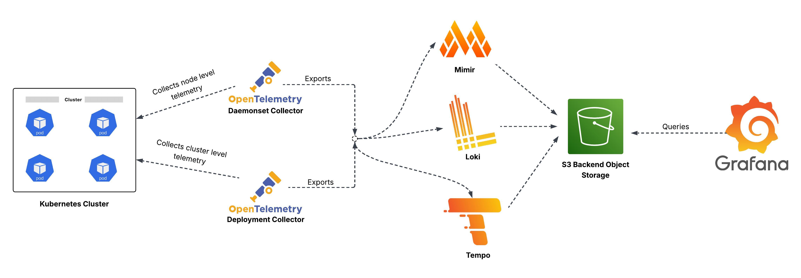

# LGTM Stack for OpenTelemetry Pipeline

This repository provides Helm charts to deploy the **LGTM stack**—**Loki**, **Grafana**, **Tempo**, and **Mimir** integrated with [OpenTelemetry Collector](https://opentelemetry.io/docs/collector/) pipeline for Kubernetes observability. The stack enables collection, storage, and visualization of **logs**, **metrics**, and **traces** from your Kubernetes cluster using modern, open-source tools.

---

## Architecture Overview

---

## Pipeline Description

### Objective

To collect telemetry (logs, metrics, and traces) from a Kubernetes cluster and route it through OpenTelemetry Collectors to dedicated backends **Grafana Mimir**, **Loki**, and **Tempo** for durable storage and visualization via **Grafana dashboards**.

---

##  How It Works

### OpenTelemetry Collector

- **DaemonSet Mode**: Runs on each node to collect **node-level telemetry**, including system logs, resource usage, and local traces.
- **Deployment Mode**: A cluster-level collector configured with the `k8s_cluster` receiver to gather **aggregated cluster telemetry**.

### Metrics Flow

- Metrics from both collectors are forwarded via OTLP to **Grafana Mimir**.
- Mimir stores these metrics in **S3-compatible object storage**, making them durable and queryable via PromQL.

### Logs Flow

- Logs are collected (via filelog or container log receivers) and pushed to **Grafana Loki**.
- Loki indexes logs and can also write log chunks to object storage.

### Traces Flow

- Trace data collected using OTLP is sent to **Grafana Tempo**.
- Tempo stores traces in S3 and links them for visualization and correlation with logs and metrics.

### Dashboards & Alerting

- Dashboards and Prometheus rules are generated using [kubernetes-mixin](https://github.com/kubernetes-monitoring/kubernetes-mixin), which provides:
  - Pre-built Grafana dashboards for cluster, node, pod, and container metrics.
  - Prometheus alerting and recording rules for node health, resource usage, and cluster status.

---

## Components Included

| Component              | Description                                                                 |
|------------------------|-----------------------------------------------------------------------------|
| [OpenTelemetry Collector](https://opentelemetry.io/docs/collector/) | Collects metrics, logs, and traces from the Kubernetes cluster. Deployed as both DaemonSet and Deployment. |
| [Grafana Mimir](https://grafana.com/oss/mimir/)                 | A scalable Prometheus-compatible metrics backend that stores data in S3.                            |
| [Grafana Loki](https://grafana.com/oss/loki/)                   | A log aggregation system that indexes and stores logs for query via Grafana.                        |
| [Grafana Tempo](https://grafana.com/oss/tempo/)                 | A distributed trace backend that stores traces and integrates with metrics/logs.                    |
| [Grafana](https://grafana.com/oss/grafana/)                     | Visualization platform connected to Mimir, Loki, and Tempo for unified observability.              |
| [Kubernetes Mixins](https://github.com/kubernetes-monitoring/kubernetes-mixin) | Used to generate Prometheus rules and Grafana dashboards tailored to Kubernetes telemetry.         |

---

## Visualization

Once deployed, Grafana connects to:
- **Mimir** → to view metrics (CPU, memory, pod restarts, etc.)
- **Loki** → to search logs by labels or content
- **Tempo** → to trace distributed services and view spans

Dashboards from Kubernetes Mixins help you quickly see:
- Cluster resource usage
- Node status
- Pod lifecycle and performance
- Alerting on key metrics like OOM kills, API failures, and more

---

